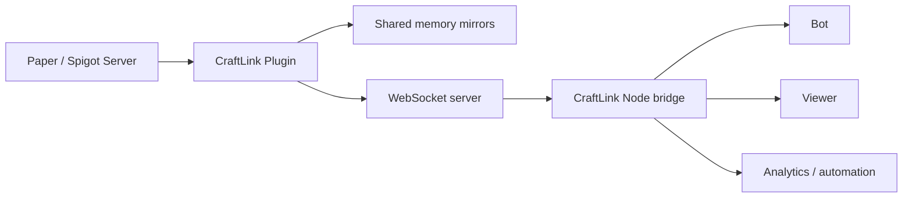

# Architecture

CraftLink is a server-authorized data plane for Minecraft Java Edition. Instead of pretending to be a Minecraft client, it runs inside the server and exports already-known world state.

## Why it is faster than mineflayer

mineflayer starts outside the server boundary and has to do full client work:

1. open a normal Minecraft connection
2. negotiate protocol state
3. decrypt, decompress, and parse packets
4. rebuild world state in JavaScript
5. keep that reconstruction current on one event loop

CraftLink removes almost all of that:

1. the plugin already sits inside the Paper server
2. chunk snapshots, entities, block events, sounds, and particles already exist in server memory
3. the plugin serializes only the data you need
4. the bridge turns that stream into JS events

## Data flow

## What CraftLink skips

Compared with a full protocol client, CraftLink avoids:

- login and play-state protocol emulation
- client-side chunk packet reconstruction
- packet compression and encryption work in JS
- entity/world bookkeeping from raw packets
- using a player slot just to observe the server

The cost moves to one targeted serialization step inside the plugin, where the server already has authoritative state.

## `/dev/shm` IPC vs WebSocket

CraftLink supports two delivery modes because the deployment shapes are different.

### `/dev/shm`

Use it when:

- your bot or analytics process runs on the same Linux host as the Paper server
- latency matters more than portability
- you want local file-based polling without a network hop

Characteristics:

- same-host only
- very low latency
- no TLS or socket setup
- ideal for tightly coupled local automation

### WebSocket

Use it when:

- the consumer runs on another machine
- you want a normal network API
- you are building bots, viewers, or dashboards in Node.js or the browser

Characteristics:

- remote-friendly
- token-gated
- supports binary subchunk frames and JSON event streams
- fan-out to multiple clients

## Binary chunks and JSON events

Chunk data is the expensive part of world state, so the plugin uses the densest format there:

- initial chunk/subchunk snapshots: binary `0x01` raw or `0x02` gzip-wrapped frames
- live world deltas and overlays: JSON messages

This split keeps bulk world transfer efficient while keeping event types easy to inspect and extend.

## Security model

CraftLink is intentionally server-owner authorized.

That means:

- the server operator installs the plugin
- the operator chooses whether to set `auth-token`
- authenticated clients are trusted to read server state
- `sendCommand()` executes commands as the server console sender

This is different from mineflayer's trust model. mineflayer is a normal client account. CraftLink is an admin-installed bridge.

Recommended deployment pattern:

1. bind the plugin to a private network when possible
2. set `auth-token`
3. if you need public internet exposure, terminate TLS in a reverse proxy or tunnel in front of the WebSocket port

## Tradeoffs

CraftLink is not a full mineflayer replacement for every action loop.

It is strongest when you want:

- fast world reads
- viewer backends
- analytics
- server-authorized automation
- zero player-slot observers

It is not, by itself, a physics simulator, pathfinder, or client-behavior stack.

