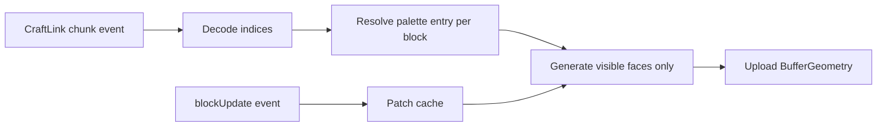

# Tutorial: Build a Viewer

CraftLink is a fast data source for a Minecraft viewer. The plugin streams world state, and the Node bridge normalizes it into JS events.

## 1. Receive chunk data

Start with a process that stores subchunks in memory.

```js
const { CraftLink } = require('craftlink');

function decodeIndices(chunk) {
  const raw = Buffer.from(chunk.indices, 'base64');
  const wide = chunk.palette.length > 256;
  const out = new Array(wide ? raw.length / 2 : raw.length);
  for (let i = 0; i < out.length; i++) {
    out[i] = wide ? raw.readUInt16LE(i * 2) : raw[i];
  }
  return out;
}

async function main() {
  const link = new CraftLink({ url: 'ws://127.0.0.1:4800', token: 'dev-token' });
  const subchunks = new Map();

  link.on('chunk', (chunk) => {
    subchunks.set(`${chunk.x},${chunk.y},${chunk.z}`, {
      palette: chunk.palette,
      indices: decodeIndices(chunk),
      skyLight: chunk.skyLight,
      blockLight: chunk.blockLight,
    });
  });

  link.on('blockUpdate', (update) => {
    console.log('apply sparse block edit', update);
  });

  link.on('raw', (msg) => {
    if (msg.type === 'ready') {
      console.log(`initial snapshot complete: ${msg.chunkCount} chunk columns`);
    }
  });

  await link.connect();
}

main().catch(console.error);
```

## 2. Turn subchunks into Three.js meshes

CraftLink does not prescribe a rendering engine. The common pattern is:

1. keep a `Map` of subchunks keyed by `x,y,z`
2. decode palette indices once
3. build one mesh per subchunk or per material batch
4. rebuild only the affected mesh when a `blockUpdate` lands

Mermaid view:



Minimal face-generation loop:

```js
for (let i = 0; i < 4096; i++) {
  const paletteIndex = indices[i];
  const block = palette[paletteIndex];
  if (block.sid === 0 || block.name === 'minecraft:air') continue;

  const x = (i >> 8) & 0xf;
  const z = (i >> 4) & 0xf;
  const y = i & 0xf;

  // Look at the 6 neighbors and emit only exposed faces.
  // Push positions, normals, uvs, and material IDs into your geometry buffers.
}
```

## 3. Render entities

`entity` and `entityGone` are already normalized for viewer use.

```js
const entities = new Map();

link.on('entity', (entity) => {
  entities.set(entity.id, entity);
});

link.on('entityGone', ({ id }) => {
  entities.delete(id);
});

function syncEntityMeshes(scene) {
  for (const entity of entities.values()) {
    // Upsert a mesh or sprite by entity.id and place it at entity.x/y/z.
  }
}
```

Useful viewer-side inputs:

- `entity.username` for player labels
- `entity.itemName` for dropped item icons
- `entity.velocity` for interpolation
- `entity.equipment` for held items and armor
- `raw` `skin` messages for player textures

## 4. Integrate with MindAxis View

CraftLink is the transport and data model. MindAxis View is the managed viewer product built on top of similar primitives.

Practical split:

- use CraftLink when you want your own renderer, analytics, or bot logic
- use MindAxis View when you want hosted viewer delivery, distribution, and operational polish

What to reuse if you later grow into a fuller viewer:

- `chunk`, `biomes`, `blockEntities`
- `entity`, `entityAnimation`, `sound`, `particle`
- `raw` `heightmap`, `inventory`, `equipment`, `skin`, `ready`

